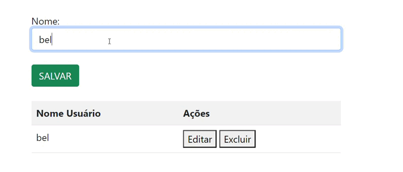

# login-cad

## ``Índice``
 
* [Introdução](#introdução)
* [Descrição](#descrição)
* [Fontes Utilizadas](#fontes-utilizadas)
* [Autor](#autor)
* [Resultado](#resultado)

## Introdução
Este projeto consiste em um sistema simples de login e cadastro de usuários, desenvolvido em JavaScript, HTML e CSS. O objetivo principal é fornecer uma interface amigável onde os usuários podem se registrar com seus nomes e, em seguida, visualizar, editar ou excluir suas informações cadastradas.

° Funcionalidades Principais:
Tela de Login: Os usuários são recebidos em uma tela de login onde devem inserir seu e-mail e senha. O sistema verifica se ambos os campos estão preenchidos e, em caso afirmativo, redireciona o usuário para a tela de cadastro.

° Cadastro de Usuários: Na tela de cadastro, os usuários podem inserir seu nome e salvá-lo em uma lista. Se o campo estiver vazio, uma mensagem de alerta será exibida solicitando que o nome seja informado.

° Manipulação da Lista de Nomes: Os usuários podem ver uma tabela com os nomes que cadastraram. Cada nome na tabela tem botões para edição e exclusão:

° Editar: Ao clicar no botão de editar, o nome selecionado será preenchido no campo de entrada, permitindo que o usuário faça alterações.
Excluir: O botão de excluir remove o nome correspondente da lista.

## Descrição
Este sistema é uma aplicação web simples desenvolvida com HTML, CSS e JavaScript, que permite aos usuários realizar login e cadastrar seus nomes. A interface é intuitiva e tem como objetivo fornecer uma experiência de usuário fluida, permitindo a manipulação de dados de forma eficiente.

Tela de Login:

° O sistema inicia com uma tela de login onde o usuário deve inserir seu e-mail e senha.

° Ao clicar no botão de login, o sistema valida se ambos os campos estão preenchidos. Se não estiverem, um alerta é exibido solicitando o preenchimento dos campos.

° Se os campos estiverem preenchidos, o usuário é redirecionado para a tela de cadastro.

Cadastro de Usuários:

° Na tela de cadastro, o usuário pode inserir seu nome em um campo de texto.

° O sistema verifica se o campo está vazio. Caso afirmativo, um alerta solicita que o nome seja informado.

° Se o nome for informado, ele é armazenado em um array chamado ´´dadosLista´´, que mantém todos os nomes cadastrados.

## Fontes Utilizadas
[CHAT GPT](https://chatgpt.com/)
[MDN WEB DOCS](https://developer.mozilla.org/pt-BR/docs/Web/JavaScript/Guide/Indexed_collections)

## Autor
[Leonardo Rocha](https://github.com/LeonardoRochaMarista)
[Maria isabel](https://github.com/belsil5aa)

## Resultado

